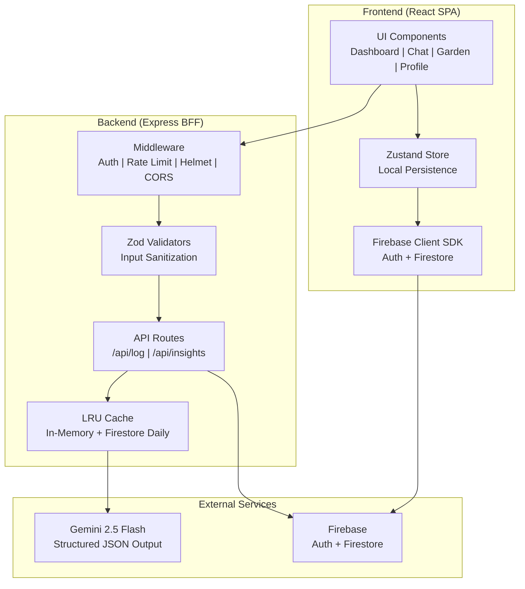

# Sustainly

## Project Overview
* **Selected challenge vertical:** Sustainability & Personal Carbon Footprint Tracking.
* **Problem statement:** Individuals often lack clear, actionable insights into their daily environmental impact and need intelligent, contextual guidance to reduce their carbon footprint.
* **Solution summary:** Sustainly is an AI-powered sustainability companion. It uses an intelligent chat interface powered by Gemini to track daily actions, calculate impact points, and provide personalized, context-aware suggestions for sustainable living.

## Architecture
* **System design:** React-based Single Page Application (SPA) with a Vite dev server + Express backend. State management is handled by Zustand with local persistence. User authentication and data backup are managed via Firebase (Auth and Firestore). The Assistant is powered by the Gemini API with structured output.
* **Component diagram:** 
  - `UI Layer`: React components (Dashboard, Profile, ChatLogger, Garden).
  - `State Layer`: Zustand (`useSustainlyStore`).
  - `Backend Integration`: Firebase services (Auth, Firestore) + Express server for AI calls.
  - `AI Integration`: Gemini API via Google GenAI SDK with response schemas.
* **Data flow:** User inputs actions in chat -> Express backend calls Gemini (with profile + history) -> Structured JSON returned -> Zustand updates local state -> Firebase syncs data.

### Architecture Diagram

## Features
* **Smart Assistant Behavior:** Natural language logging of daily activities with image support.
* **Dynamic Decision Making:** AI calculates CO₂e, assigns gamification points, and suggests personalized offsetting actions.
* **Context-Aware Responses:** The Gemini AI uses user profile and history for relevant continuous feedback.
* **Virtual Garden:** A visual representation of user impact, growing trees and flowers based on points earned.
* **Gamification:** Streaks, points, and daily suggested actions.
* **Dark Mode:** Seamless light/dark theme persistence across sessions.
* **Offline Support & PWA:** Full service worker caching for static assets and stale-while-revalidate caching for Gemini insights, enabling offline access.

## Code Quality & Architecture
* **useAuth Hook & LoadingScreen:** Authentication logic is isolated into a clean, custom `useAuth` hook, separating concerns from `App.tsx` and providing a dedicated `LoadingScreen` component.
* **Type Safety & Zod Validation:** The Zustand store slices are hardened with Zod schema validation for profile profiles and strict TypeScript definitions, preventing data pollution from Firestore.

## Setup Instructions
* **Installation:** Run `npm install`
* **Environment variables:** Create a `.env` file based on `.env.example`. Requires Firebase config + `GEMINI_API_KEY` (used on the backend).
* **Firebase Security Rules:** After deploying, go to Firebase Console → Firestore → Rules and paste the content from `firestore.rules` (or deploy using Firebase CLI).
* **Running locally:** Run `npm run dev` to start both frontend and backend.
* **Deployment:** 
  - Frontend: Vercel, Netlify, or Firebase Hosting
  - Backend: Can be deployed to Render, Railway, or as Firebase Functions
  - Run `npm run build` to generate static files

## Usage Examples
* **Example inputs:** "I rode my bike 5 miles today and ate a vegan lunch."
* **Example outputs:** The AI Assistant logs: 1x Bike Ride (25 pts), 1x Vegan Meal (30 pts). It then suggests: "Great job! Would you like to try composting your kitchen scraps this week?"
* **User workflows:** User signs up -> completes onboarding (diet, commute) -> talks to the chat logger daily to earn points -> views progress and grows their virtual garden.

## Assumptions
* **Business assumptions:** Users want to track their carbon footprint but prefer conversational interfaces over manual forms.
* **Technical assumptions:** The Gemini API is available and can reliably extract structured JSON entities from unstructured text + images.

## Security Considerations
* **Data handling:** User profiles and logs are stored in Firestore, protected by `firestore.rules` so users can only read/write their own data.
* **CSRF Protection:** Hardened with a global backend CSRF protection middleware (`csrfProtection`) on all mutating HTTP methods (POST, PUT, DELETE, PATCH) and cookie tokens coupled with a frontend fetch interceptor (`apiClient`).
* **API Protection:** Strict rate limiting on AI endpoints (5 requests/min per IP) + input validation.
* **Privacy protections:** No public sharing of user data; email authentication + Firebase rules limit unauthorized access.
* **No secrets in frontend:** `GEMINI_API_KEY` lives only on the backend.

## Accessibility
Sustainly complies with WCAG 2.1 guidelines. Key features include:
* **Keyboard Navigation**: Full support for tabbing through interactive elements without mouse dependency.
* **Focus Trap & Accessible Dialog**: Reusable, screen-reader friendly `Dialog` component implementing focus traps, Escape key dismissal, and appropriate ARIA attributes (`role="dialog"`, `aria-modal="true"`, `aria-labelledby`).
* **ARIA Usage**: Thorough implementation of ARIA labels, roles, and descriptions (e.g., in `AccessibleChat.tsx`) for screen reader support.
* **Continuous Auditing**: CI pipelines run automated accessibility checks using `@axe-core/playwright` to prevent regressions.

## Testing
* **How to run tests:**
  - Unit/Integration Tests: `npm run test` (Vitest)
  - End-to-End Tests: `npx playwright test` (Playwright)
* **Test Coverage:**
  - Unit & integration tests are configured with a minimum of 80% coverage check in `vitest.config.ts`.
  - Playwright E2E tests cover the complete user journey: login → onboarding → Chat AI logging → garden growth, and run automated accessibility scans.
* **CI Integration:** A GitHub Actions workflow (`ci.yml`) runs both unit/integration tests and Playwright E2E tests automatically on every push or PR to `main`.

## Troubleshooting
* **Firebase errors (Permission Denied):** Ensure your `firestore.rules` are deployed correctly, or you are signed in.
* **Firebase Admin (No Project ID):** If `FIREBASE_SERVICE_ACCOUNT` is missing, the backend relies on Application Default Credentials (ADC). Run `gcloud auth application-default login` if running locally without a service account JSON.
* **Gemini API Error (401 / 429 / 500):** Check that your `.env` contains a valid `GEMINI_API_KEY`. If 429, you are hitting the rate limit (5 requests / min per IP).

## Future Improvements
* Streaming AI responses for real-time chat experience
* Leaderboards and social features
* Integration with real carbon tracking APIs or IoT devices
* Push notifications for streak reminders
* Data export in multiple formats (CSV, PDF)
